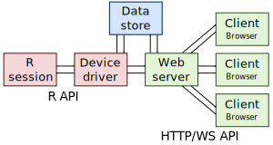

# httpgd technical documentation (WIP)

*Note: This document is incomplete and work in progress (WIP).*



httpgd is divided in a number of core components.


## Backend

The backend is written entirely in C++.

### GraphicsDevice

The GraphicsDevice is the core of httpgd.

It's main function is collecting draw calls and collecting them in a data store which can be accessed asynchronously without calling into R.

It uses a state machine to create stateless access to the (stateful) R GraphicsEngine.

Statelessnes is essential to keep the API implementation simple and allow for continue adding to a unfinished plot after (for example) a resize of a previous plot happened.

### SVG renderer

The SVG renderer is heavily based on the `svglite` package, but can perform more optimizations as all draw call components are known when the renderer is evoked.

We use the `fmt` library for fast and secure string interpolation.

### HTTP/Websocket server

The HTTP/Websocket server is based on `Boost/Beast`. Different options were investigated but Beast had various advantages: 

- It's header only, which makes it far easyer to ship with the R build system.
- The package `BH` provides it in its entirety (after we asked them) and is able to provide updates independently of httpgd.
- Boost contains extremely well written peer reviewed code that will be supported indefinitely. (And might even make it into the standard library.)

The only drawback of using Beast is, that it is very low level. We currently use `belle` which provides a nice API on top of Beast, but is not updated regularly. For this reason we had to make various fixes and changes to belle. On the long run belle should probably be replaced by our own custom abstraction layer.

### Plot history

The plot history is a growing R list of GraphicsEngine snapshots. It has a fairly straightforward implementation on top of `cpp11::writable::list`.

### R API

The R API is oriented on the HTTP API. Simple functions offer the same access as sending requests to the server. The main difference for the implementation is that the access is already from within the R thread.

The graphics device being stateless allows for access and resizing of current and past plots.

## Frontend

While application and library authors might decide on implementing their own web clients, we ship a fully functional standalone HTML/JavaScript client which serves as both a reference implementation as well as a way to use httpgd interactively without any other package.

### HTML/JS client

The client logic is written as a TypeScript module for both correctnes and portability.

It can be embedded in a light HTML document which is styled with minimal CSS. 

For portability reasons all the HTML, JavaScript and CSS will remain standalone with zero dependencies.


## Building and debugging

httpgd is designed to be built atomatically by the R build system. Exception to this is the TypeScript client which needs to be built manually by calling `tsc` from inside `./inst/www`.

### Debugging the HTML/JS client

The HTML/JS client can be debugged withour having to rebuild httpgd for fast debugging.

1) Start httpgd with CORS and security token disabled on a fixed port:

```R
hgd(cors=TRUE, token=FALSE, port=8082)
```

2) Serve `inst/www/` with your static development HTTP server of choice.

3) Call your development server and attach the `host` parameter:

```
http://172.0.0.1:{port}/index.html?host=172.0.0.1:8082
```
